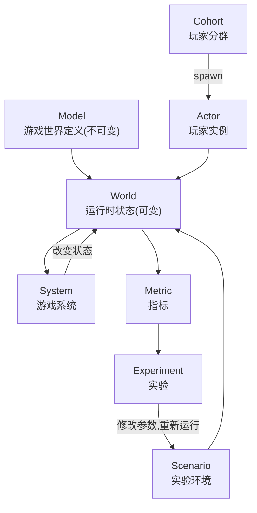
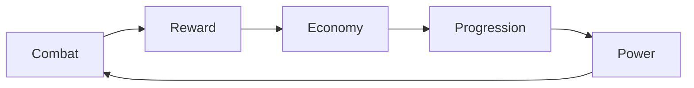

# 核心概念

Sandtable 的核心不是功能列表,而是七个模型概念:

```text
Model · Actor · Cohort · System · Scenario · Metric · Experiment
```

## 概念关系



## Model 与 World:定义与状态分离

::: warning 边界必须划清
**Model 是不可变的**——配置的编译产物,回答"游戏是什么":数值、公式、规则定义。**World 是可变的**——运行时状态,包含 Clock、Event Queue、实体状态、RNG 游标等。Clock 和 Event Queue 是运行时机制,不是"游戏是什么"的一部分,因此属于 World 而不属于 Model。
:::

| 归属 | 内容 | 生命周期 |
| --- | --- | --- |
| Model | 数值表、公式、系统参数、行为概率定义 | 一次实验内不变,跨候选可复用 |
| World | 实体状态、Clock、Event Queue、RNG 状态、指标聚合器 | 每次运行独立初始化 |

Model 示例(不绑定某一款具体游戏):

```yaml
stats:
  warrior:
    attack: 100
    defense: 80

monsters:
  slime:
    hp: 500
    defense: 30
```

## Actor:玩家行为模型

Actor 描述"谁在玩,以及如何行动",不只是一组属性:

```text
Actor
├── State          运行时状态(等级、金币、战力……)
├── Attributes     静态属性
├── Goals          目标
├── Strategy       策略
├── Schedule       活动安排
├── Preferences    偏好
└── Decision Model 决策模型
```

第一阶段采用简单可配置的行为模型:

```yaml
actor:
  type: casual
  activity:
    sessions_per_day: 2
    session_duration: 20m
  behavior:
    dungeon_probability: 0.7
    upgrade_probability: 0.2
    explore_probability: 0.1
```

复杂行为模型后续再扩展,扩展接口见[配置与公式引擎](./07-config-formula)。

## Cohort:玩家分群

Cohort 与 Actor 分开:

- **Cohort** 是一类玩家的统计 / 行为模型(Casual、Core、Whale、Returning、Churn Risk);
- **Actor** 是模拟运行过程中产生的具体玩家实例。

```text
Cohort → spawn → Actors → behavior → World → Metrics → Cohort Analysis
```

MVP 内置 Casual / Core / Whale 三群;Whale 的 MVP 定义(无付费系统时的替代口径)见 [KPI 与指标](./13-kpi-metrics)。

## System:游戏系统

System 描述游戏系统如何改变世界状态。典型系统:

```text
Combat · Economy · Progression · Inventory · Reward · Activity · Daily Reset
```

系统之间允许形成反馈环:



这正是 Sandtable 与单场战斗模拟器的重要区别:反馈环使参数效应随时间累积、放大或衰减,单场模拟看不见这些。

## Scenario:仿真场景

Scenario 描述"一次实验如何运行":

```yaml
scenario:
  duration: 30d
  population: 10000
  population_mix:
    casual: 0.60
    core: 0.30
    whale: 0.10
  seed: 123456
```

::: tip 设计承诺
Model 描述游戏本身,Scenario 描述实验环境,**二者必须分离**。同一 Model 配不同 Scenario(不同人群、时长、seed),或同一 Scenario 配不同参数的 Model,都是常规操作,不需要复制配置文件。
:::

## Metric:指标

Metric 描述"如何判断系统运行得好不好"。支持:

```text
Scalar · Time Series · Distribution · Histogram · Percentile · Cohort · Correlation
```

```yaml
targets:
  combat.win_rate:
    min: 0.48
    max: 0.52
  economy.inflation:
    max: 0.05
  progression.day_7_power:
    min: 10000
    max: 15000
```

Metric 不只是仿真结束后的统计值,而是系统目标的一部分——约束判定、候选排名、平衡推荐都建立在 Metric 之上(见 [KPI 与指标](./13-kpi-metrics))。

## Experiment:实验

Experiment 描述"如何改变参数并比较结果":

```text
Parameter Space → Simulation → Metrics → Constraints → Ranking → Recommendation
```

第一阶段支持 Grid Search、Random Search、Monte Carlo、Parameter Sweep;Latin Hypercube 已落地(2026-10-09,`mode: latin_hypercube`,见[参数扫描](./12-parameter-sweep));后续支持 Bayesian / Evolutionary / Pareto Optimization。实验是核心模型,不是 CLI 外面的脚本([实验管线](./11-experiment-pipeline))。
