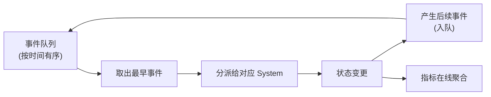

# 仿真内核

Simulation Kernel 是整个项目最重要的技术资产。

## 组成

```text
World
├── Clock          宏观时间(天)与事件时间戳
├── RNG            带键随机数派生(见确定性随机数)
├── Entity Store   实体存储(有序容器,保证迭代确定)
├── State          运行时状态
├── Systems        系统注册表
└── Event Queue    离散事件队列
```

内核只提供机制,不提供策略:它不知道"战斗怎么算""金币怎么发",这些由注册进来的 System 实现。MVP 阶段 System 以硬编码形式提供(见 [MVP](./16-mvp)),配置驱动随后抽取。

## 执行循环

宏观时间线采用离散事件推进([为什么](./05-time-model)):



两个要点:

1. **时间只在事件之间跳跃。** 两个事件之间没有计算发生,因此一天内只处理实际发生的几十到几百个事件,而不是按固定步长空转。
2. **指标在事件处理时增量更新**,不在结束后回放个体明细(见[在线聚合](./13-kpi-metrics))。

## Model 编译与 World 构建

一次运行的初始化顺序:

```text
配置文件 → 校验 → 编译为 Model(不可变)
→ 按 Scenario 构建 World(实体、事件队列、RNG、聚合器)
→ 逐事件推进 → 输出指标
```

Model 编译发生在运行前:公式在此阶段解析为可执行形式(见[公式引擎](./07-config-formula)),参数路径在此阶段解析为索引。运行期不做任何配置字符串查找。

## 并行模型

- **实验级并行**:不同候选(参数组合)之间相互独立,用 rayon 并行执行(见[参数扫描](./12-parameter-sweep))。这是 MVP 的主要并行方式。
- **玩家级并行**:[玩家独立假设](./01-positioning)成立时,玩家状态互不依赖,可以按玩家切分并行。涉及浮点聚合时必须遵守并行确定性规则(见[确定性随机数](./06-deterministic-rng))。

## 平台可移植性边界

内核的目标平台是 **native(CLI / 桌面)与 wasm32(浏览器)**,从 Phase 1 起以 CI 门禁保证 `cargo check --target wasm32-unknown-unknown` 通过——编译能力不是"以后再补",是架构承诺:

| 规则 | 理由 |
| --- | --- |
| core 热路径**串行确定**:算法写成串行,并行是实验层注入的能力(feature 开关) | 并行本来就要服从确定性规则;WASM 单线程下自动退化为串行,行为不变 |
| core 内禁止文件 / 网络 I/O、禁止 `Instant::now` 壁钟、禁止平台库(`duckdb` / `web-sys` / `tokio`) | 仿真时间只来自模拟钟;平台适配放在壳层(`sandtable-cli` / `sandtable-wasm` / 桌面壳) |
| 随机消费全部走带键派生,跨平台算术优先整数 / 定点 | 见[确定性随机数](./06-deterministic-rng)跨平台提示 |

::: warning 一条红线
分析引擎不进 core。`use duckdb::*` 或 `use web_sys::*` 出现在 core 里即为架构回归——core 的依赖树里只有纯 Rust。
:::

## 架构级性能约束

- MVP 目标:10,000 玩家 × 30 天,在开发机上分钟级完成([算力依据](./05-time-model))。
- 后续目标:100,000 玩家 × 30–90 天。这要求指标采集从第一天起就是在线聚合,不能"先存明细、结束后统计"——明细存储在这个量级不可行(见[在线聚合](./13-kpi-metrics))。
- 内核保持 headless、无 I/O 依赖:输入配置与 seed,输出指标,不依赖网络、数据库与图形界面。
