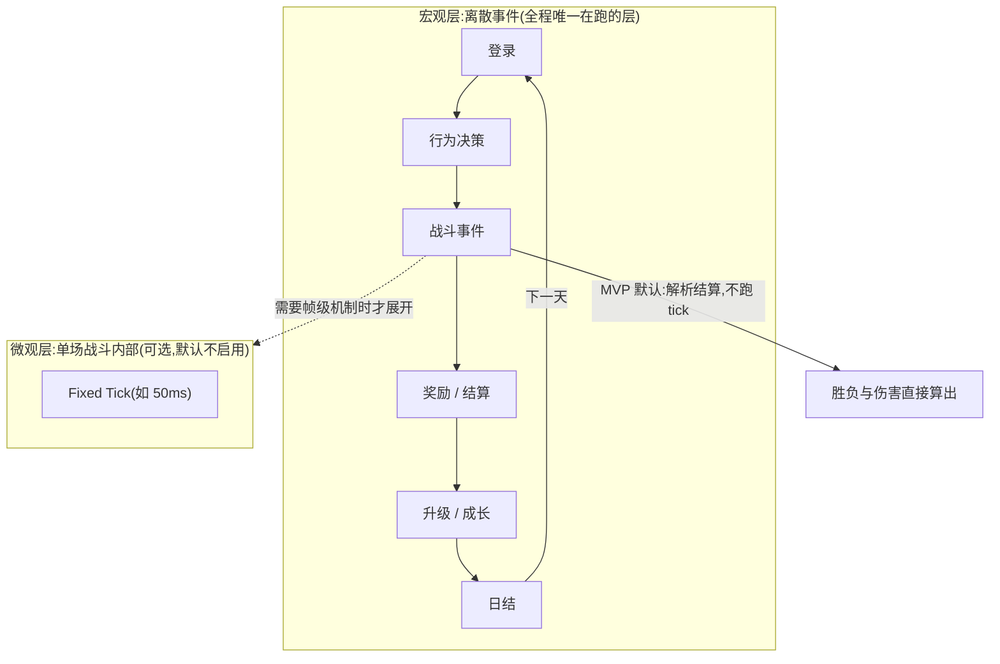

# 时间模型

## 问题:全程固定 tick 是算力陷阱

如果仿真全程按固定 tick 推进(例如 50ms 一个 tick),以 MVP 实验规模计算:

```text
30 天 = 2,592,000 秒
2,592,000 秒 ÷ 0.05 秒/tick ≈ 5,180 万 tick / 玩家
× 10,000 玩家 ≈ 5.2 × 10¹¹ 次状态更新
```

5×10¹¹ 次更新远超"开发机上快速完成"的[MVP 性能目标](#性能目标)。结论:**全程 tick 不可行**,这不是优化问题,是模型选型问题。

## 方案:分层嵌套时间模型

时间模型分两层,**嵌套关系,不是并列关系**:



### 宏观层:离散事件

登录、战斗、奖励、升级、每日结算、离线收益等全部建模为离散事件,事件队列按时间排序,时间只在事件之间跳跃:

```text
Day 1 09:00  Login
Day 1 09:03  Battle
Day 1 09:05  Reward
Day 1 09:06  Upgrade
Day 1 10:00  Logout
```

一天内一个玩家实际发生的事件只有几十到几百个。10,000 玩家 × 30 天 × ~百事件/天 ≈ **10⁷–10⁸ 量级事件**,与全程 tick 的 5×10¹¹ 相差 3–4 个数量级,这就是可行的原因。

### 微观层:战斗内部 tick(可选)

Fixed Tick 只在单场战斗内部使用,适合帧级机制:DPS、Buff / Debuff、冷却、走位。战斗在宏观层是**一个事件**;若该战斗需要帧级机制,才在事件内部展开 tick 子模拟,输入双方状态,输出胜负与伤害,再回到宏观层。

### MVP:解析结算

MVP 的战斗不跑 tick,用**解析结算**:给定双方状态与命中 / 伤害公式,直接计算期望结果并按公式随机化,一次计算出胜负与损耗。回合制或期望结算够用的游戏,解析结算已经覆盖;需要帧级机制的战斗类型,等出现真实需求再实现 tick 子模拟。

::: warning 决策记录
"全程 tick"与"分层嵌套"不是两种实现风格,是 5×10¹¹ 与 10⁷ 两个量级的差别。任何把宏观层改回固定步长推进的提议,都需要先重新过一遍这笔算力账。
:::

## 机制归层准则

| 机制 | 归属层 | 理由 |
| --- | --- | --- |
| 登录、离线收益、日结 | 宏观离散事件 | 天然以"次"为单位发生 |
| 行为决策、奖励、升级 | 宏观离散事件 | 事件型,无连续状态演化 |
| 回合制 / 期望战斗 | 宏观事件(解析结算) | 期望可闭式计算 |
| 帧级 Buff / 冷却 / DPS | 微观 tick(可选) | 需要连续时间轴 |

## 性能目标

MVP 不追求极限 benchmark,但架构上必须允许并行:

```text
MVP:  10,000 players × 30 days   开发机分钟级完成
后续: 100,000 players × 30~90 days
```

并行的主要粒度是实验级(候选之间),玩家级并行依赖[玩家独立假设](./01-positioning)。浮点聚合的确定性规则见[确定性随机数](./06-deterministic-rng)。
