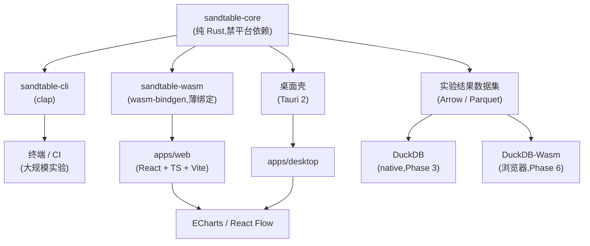

# 技术栈

## 语言与形态

核心实现语言为 **Rust**。理由:高性能、内存安全、并行能力强、CLI 生态成熟、可编译为 WASM、可嵌入 Tauri,适合长期运行大规模仿真。

核心要求:

```text
Deterministic · Headless · Parallel · Embeddable · Testable · Platform-portable
```

## 总体架构:一个内核,三种壳



三个形态共用同一内核;**严禁为 Web 单独实现一份 JS 仿真**——那会导致 Web 与桌面结果不一致,破坏可复现承诺(见[产品边界](./02-scope))。

## 选型总表

| 层 | 技术 | 阶段 |
| --- | --- | --- |
| Core | Rust | MVP |
| CLI | clap | MVP |
| **WASM 绑定** | wasm-bindgen(**架构一等目标**:Phase 1 起 `wasm32-unknown-unknown` 编译门禁;绑定层 Phase 6) | 门禁 MVP / 绑定 Phase 6 |
| **Web** | React + TypeScript + Vite | Phase 6 |
| **Desktop** | Tauri 2(Windows 主力形态;Web UI + Rust 后端,无 Node / Python 服务) | Phase 7 |
| **分析(native)** | DuckDB(duckdb-rs:内存 / 文件库、Arrow 互操作、读 Parquet / CSV / JSON) | Phase 3 |
| **分析(浏览器)** | DuckDB-Wasm(默认单线程;WASM 内存有官方 4GB 上限,浏览器实际更严) | Phase 6 |
| **数据契约** | Arrow / Parquet(MVP 例外:JSON + CSV,但 schema 按 Arrow 契约设计,见[数据输出](./09-data-output)) | 契约 MVP / 载体 Phase 2 |
| 序列化 | serde + serde_json | MVP |
| 配置(YAML) | serde_yaml_ng(选型理由见[配置与公式引擎](./07-config-formula)) | MVP |
| 错误处理 | thiserror(core)/ anyhow(cli) | MVP |
| 随机数 | rand_core 兼容的带键派生(见[确定性随机数](./06-deterministic-rng)) | MVP |
| 并行 | rayon(feature 开关;仅实验级并行,WASM 下退化串行,行为不变) | MVP |
| 表达式求值 | 内置最小求值器(加载期编译) | MVP |
| 数据输出 | JSON + CSV | MVP |
| 测试 | Rust 内置 test + 快照 | MVP |
| Benchmark | criterion | MVP 起,按需 |
| CI | GitHub Actions(含 wasm32 门禁) | MVP |
| 图表 | ECharts | Phase 5+ |
| 系统图 | React Flow | 后续 |
| 脚本扩展候选 | rhai(评估项,未定) | 后续 |
| Python 绑定 | 另行命名(PyPI `sandtable` 已被占用) | 后续 |
| Web API | Axum(**默认不需要**:local-first;仅在确需服务端时随 tokio 引入) | 按需 |

## 依赖纪律

::: warning 红线
- **core 依赖树里只有纯 Rust**:`duckdb` / `web-sys` / `tokio` / 任何数据库客户端出现在 core 里即为架构回归;平台适配全部在壳层(cli / wasm / 桌面壳);
- **分析引擎不碰仿真状态**:DuckDB 只读结果数据集,仿真状态是 Rust 结构体(见[数据输出](./09-data-output));
- 引入任何依赖前检查许可证兼容性(Apache-2.0 项目排除 AGPL 依赖,实例:evalexpr);
- criterion 只在 Benchmark 一行出现,不与测试混记。
:::

## crate 划分

MVP 只拆两个 crate,避免过度工程化;平台壳按阶段增加:

| crate / 目录 | 职责 | 阶段 |
| --- | --- | --- |
| `sandtable-core` | 内核 + 配置 + 实验:model / config / rng / time / world / systems / metrics / experiment | MVP |
| `sandtable-cli` | clap 命令行,薄封装 core | MVP |
| `sandtable-wasm` | wasm-bindgen 薄绑定(`run_simulation` / `validate_config` 等,**不放仿真逻辑**) | Phase 6 |
| `apps/web` | React + TS + Vite 前端 | Phase 6 |
| `apps/desktop` | Tauri 2 壳 | Phase 7 |
| `sandtable-analytics` | 若分析层(DuckDB 查询、数据集构建)膨胀再独立 | 按需评估 |

::: warning 命名约定
内置系统(战斗、经济、成长等)在 core 内的模块叫 **`systems`**。若未来独立成 crate,命名为 `sandtable-systems`——**不用 `sandtable-model`**,避免与概念上的 Model(配置编译产物)重名混淆。
:::

## 原则

> Core 尽量保持纯 Rust:不依赖 Web,不依赖数据库,不依赖具体游戏引擎;Local-first,默认无服务器、无账号。

core 不依赖 cli / wasm;systems 不依赖 experiment;kernel 不依赖任何上层;分析层只被壳层调用。
