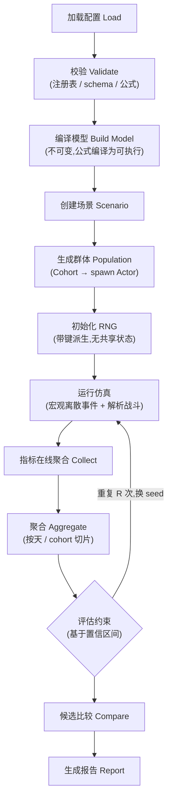

# 实验管线

## 全流程

## 关键步骤说明

- **编译模型**:配置在此阶段校验并编译(公式编译、参数路径解析),运行期零字符串查找([公式引擎](./07-config-formula));
- **运行仿真**:一个候选的一次运行;宏观层离散事件推进,战斗解析结算([时间模型](./05-time-model));
- **指标在线聚合**:事件处理时增量更新直方图与统计量,不落个体明细([在线聚合](./13-kpi-metrics));
- **评估约束**:[hard / soft 约束判定基于置信区间](./13-kpi-metrics),不是点估计。

## Replicates:重复次数与人口规模是两回事

::: warning 统计单位
10,000 个玩家 ≠ 10,000 个独立样本。同一 run 内的玩家共享模型与事件结构,彼此相关。**统计单位是"一次完整运行"(replicate)**:一个 replicate 先把玩家聚合为一个指标值,R 个 replicate(不同 seed)才构成 R 个近似独立的样本。
:::

置信区间在 replicate 层面计算(公式见 [KPI 与指标](./13-kpi-metrics));R 默认 5–10,预算敏感的指标可先 3 个 seed 粗筛。

## 并行与预算

- 候选之间并行(rayon);候选内 replicates 也可并行;
- 成本 = 候选数 × R × 单次运行成本;[参数扫描](./12-parameter-sweep)的网格设计要先过这笔账;
- 每个候选的每个 replicate 写独立目录,失败的 replicate 不污染已完成的结果([输出约定](./09-data-output))。
