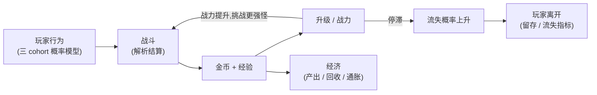

# MVP

MVP 不以功能数量验收,以**一个极小但完整的闭环**是否成立验收。

## 闭环



```text
Player → Fight Monster → Gold + XP → Level Up → Power Increase
→ Fight Stronger Monster → More Reward → ↺
```

涉及系统:Combat · Economy · Progression · Reward · Actor。

## 硬编码,先跑通

::: tip 纵向切片原则
MVP 的最小 RPG 全部**硬编码**(数值、概率、曲线写在代码里),不做配置驱动。理由:闭环成立是第一目标;"先做通用内核再做游戏"容易把抽象做偏。配置驱动、公式引擎、参数注册表在闭环验证后抽取(见[路线图](./18-roadmap) Phase 2)。MVP 阶段可调的参数只有 seed 与少量实验开关。
:::

## 实验设定

```text
10,000 players · 30 days · R 个 replicates(默认 5)
Casual 60% · Core 30% · Whale 10%(Whale = 高活跃 + 成长倍率,见指标定义)
```

输出时点:Day 1 / 3 / 7 / 14 / 30。

## 指标集

全部采用 [KPI 与指标](./13-kpi-metrics)定义的公式:

```text
Win Rate · Death Rate · Level / Power 分布(D1~D30)
Gold 存量 · Income / Spending
Inflation(存量日增长率)· Sink Ratio
Retention(D1 / D7 / D14 / D30)· Churn Rate
Dungeon Progress
```

## A/B 对比

MVP 的标志性实验:攻击力 100 vs 105,同 seed 组(带键随机数保证可比路径):

```text
ΔD7 Power · ΔD7 Gold · ΔWinRate · ΔProgression · ΔInflation
每个差值附 CI₉₅ 与效应量 d
```

如果这份报告能稳定、可复现地产出,且差值方向与机制解释一致,Sandtable 的核心价值(相对比较)就得到了验证。

## 建模假设(重申)

玩家相互独立、只有 PvE、经济是聚合指标(见[项目定位](./01-positioning))。MVP 所有设计与验收均在此前提内。

## 验收标准

```text
配置(实验开关) → 建立世界 → 生成玩家群体 → 玩家执行行为 → 战斗
→ 获得资源 → 成长 → 继续活动 → 时间推进(30 天) → 收集 KPI
→ 改变参数 → 重新运行 → 比较结果 → 给出参数建议
```

| # | 验收项 | 判据 |
| --- | --- | --- |
| 1 | 闭环跑通 | 10,000 玩家 × 30 天完整运行,无手动干预 |
| 2 | 指标产出 | 上表指标全部按公式输出,附 CI |
| 3 | A/B 对比 | simulate + compare 两个子命令产出含 CI 的差值报告 |
| 4 | 确定性 | 同 seed 重跑,summary 逐位一致 |
| 5 | 正确性 | 解析解对照测试通过(闭式期望伤害 / 期望收益,见[测试策略](./19-testing)) |
| 6 | 性能 | 开发机(普通笔记本)分钟级完成 |
| 7 | 复现性 | [实验标识](./06-deterministic-rng)五元组写入输出 |

七项齐备 → **Sandtable MVP 成立**。

## MVP 明确不包含

- 配置驱动与公式引擎(Phase 2);
- 通用 Kernel 抽取(Phase 2,从切片中抽);
- Sweep / 敏感性 / 推荐(Phase 3–4);
- HTML 报告(Phase 5);
- 付费事件与一切玩家间交互。
