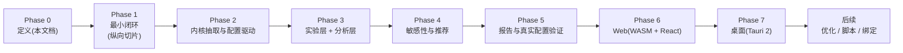

# 路线图

## 方法:纵向切片

::: warning 为什么改掉"先内核后游戏"的顺序
原阶段规划存在依赖倒置:Phase 2 要求"跑完 30 天循环",但 Metrics 排在 Phase 4——没有指标就无法验收 30 天循环。更根本的问题:**先做通用内核再做游戏,容易把抽象做偏**(为想象中的游戏设计接口)。

修正为**纵向切片**:先把最小 RPG 硬编码跑通(含最简指标与一次 A/B 对比),验证闭环成立,再从切片中抽取通用内核。抽象从真实代码中长出来,不从想象中设计出来。
:::

## 总览

::: tip 平台纪律
Web 与桌面排在 Phase 6 / 7,**但它们的架构前提从 Phase 1 起由 CI 门禁强制**:core 可编译 `wasm32-unknown-unknown`、core 依赖树无平台库、并行可退化为串行(见[仿真内核](./04-kernel))。功能后置,边界不后置。
:::

## Phase 0 — 定义(已完成)

核心概念、时间模型、RNG、指标公式、约束判定、路线图,全部成文(即本站)。

## Phase 1 — 最小闭环(纵向切片)

**做**:硬编码最小 RPG([MVP 定义](./16-mvp)):Actor 概率行为 + 解析战斗 + 奖励 + 成长 + 流失机制;按天推进 30 天;[指标公式集](./13-kpi-metrics)的最小实现(WinRate / Power 分布 / 金字与通胀 / 留存流失);CLI `simulate` + `compare`;一次 attack=100 vs 105 的 A/B 报告。

**平台门禁(本阶段起进 CI)**:
- `cargo check --target wasm32-unknown-unknown` 通过(core 不引入任何平台依赖);
- 输出 schema 按 Arrow 契约设计(列名 / 类型可直映射 RecordBatch,见[数据输出](./09-data-output))。

**验证**:
- 确定性快照:同 seed 重跑逐位一致;
- 解析解对照:闭式期望伤害、独立期望收益与仿真均值一致([测试策略](./19-testing));
- MVP 验收七项([MVP](./16-mvp))全部通过。

**验收**:上表七项齐备 → MVP 成立。

## Phase 2 — 内核抽取与配置驱动

**做**:从切片中抽取通用 World / 事件队列 / Clock / 带键 RNG / 在线聚合指标;引入 YAML 配置(Model 与 Scenario 分离)、参数注册表、config_hash、schema_version、公式引擎(加载期编译);Cohort 参数化;内置系统迁入 `systems` 模块,行为不变;Arrow / Parquet 导出以 feature 提供(MVP 的 JSON + CSV 保持默认)。

**验收**:
- 抽取后同一实验结果与 Phase 1 **逐位一致**(重构不改行为);
- 同一份 YAML 在改键序、加注释后 config_hash 不变;
- 改配置不改代码可跑通同一实验。

## Phase 3 — 实验层 + 分析层

**做**:Grid / Random 扫描、replicates 编排、候选并行(rayon)、`sweep` 子命令、基于置信区间的约束判定、比较报告;**DuckDB 分析层(native)**:duckdb-rs 读结果数据集(Parquet / CSV),SQL 事后探索(分 cohort 战力、经济收支等),不进仿真路径。

**验收**:修改参数范围后自动生成候选实验并比较;约束判定输出 PASS / BORDERLINE / FAIL 三态(见[指标](./13-kpi-metrics))。

## Phase 4 — 敏感性与推荐

**做**:OAT 弹性(从网格数据提取)、单参数轴插值推荐区间、Confidence 判据、`recommend` 输出。

**验收**:能从实验结果给出参数区间与置信度,而不是只输出原始数据;区间端点可追溯到插值过程。

## Phase 5 — 报告与真实配置验证

**做**:HTML 报告(图表、KPI、参数对比);**真实配置验证节点**——拿一个真实或公开游戏的数值配置接入跑通全管线;评估 Excel / CSV 配置导入。

**验收**:外部配置(非最小 RPG)端到端跑通 simulate → sweep → recommend,暴露并修复接入层的真实阻力。**已完成**:宝可梦(第一世代关都)案例接入,零模型改动全链跑通,阻力清单与后续候选见[真实配置验证](./21-pokemon-case);CSV 导入以 `params export / import` 落地(见 [CLI](./10-cli))。

## Phase 6 — Web(WASM + React)

**做**:`sandtable-wasm` 薄绑定(run_simulation / validate_config,不放仿真逻辑);React + TS + Vite 前端;DuckDB-Wasm 本地分析;"Try in your browser"——打开页面、导入[项目文件](./09-data-output)或配置、本地跑小中型仿真、图表直接出,零安装。

**进度**:绑定、前端骨架与 DuckDB-Wasm 查询面板已落地(配置编辑 → 本地仿真 → KPI/按天曲线/分群表 → SQL 查询出图,等价测试锁死,见 [Web 端](./22-web));sweep 前端化未做。

**边界**:Web 只承诺小中型仿真(DuckDB-Wasm 默认单线程、WASM 内存 4GB 上限);万级玩家大型 sweep 引导走 CLI / 桌面。

**验收**:浏览器与 CLI 用同一配置同 seed,结果统计等价([测试策略](./19-testing));结果可由 DuckDB-Wasm 查询并出图。**已完成**:等价由 `web_parity` 测试逐值锁死,DuckDB-Wasm 查询面板落地,见 [Web 端](./22-web)。

## Phase 7 — 桌面(Tauri 2)

**做**:Tauri 2 壳(React UI + Rust 后端),native 仿真 + native DuckDB + 本地文件;面向 Windows 等平台的主力形态,无 Node / Python 后端。

**验收**:桌面端跑通与 CLI 等价的完整实验流;安装包在 Windows / macOS 可用。

## 后续方向

- 参数优化:Bayesian / Evolutionary / Pareto;
- 复杂行为脚本:评估 rhai(见[公式引擎](./07-config-formula));
- Python 绑定(另行命名,见[项目结构](./17-project-structure));
- 项目导入 / 导出格式定型(见[数据输出](./09-data-output));
- 游戏引擎 Adapter;Web API(仅当出现真实的服务端需求,local-first 不预设)。

## 节奏约束

- 每个 Phase 结束时文档与实现同步更新,口径不一致以先改文档再改码为准;
- Phase 1 之前不写任何"通用"代码;每个 Phase 有可运行的产出物。
