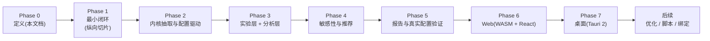

# 路线图

## 方法:纵向切片

::: warning 为什么改掉"先内核后游戏"的顺序
原阶段规划存在依赖倒置:Phase 2 要求"跑完 30 天循环",但 Metrics 排在 Phase 4——没有指标就无法验收 30 天循环。更根本的问题:**先做通用内核再做游戏,容易把抽象做偏**(为想象中的游戏设计接口)。

修正为**纵向切片**:先把最小 RPG 硬编码跑通(含最简指标与一次 A/B 对比),验证闭环成立,再从切片中抽取通用内核。抽象从真实代码中长出来,不从想象中设计出来。
:::

## 总览

::: tip 平台纪律
Web 与桌面排在 Phase 6 / 7,**但它们的架构前提从 Phase 1 起由 CI 门禁强制**:core 可编译 `wasm32-unknown-unknown`、core 依赖树无平台库、并行可退化为串行(见[仿真内核](./04-kernel))。功能后置,边界不后置。
:::

## Phase 0 — 定义(已完成)

核心概念、时间模型、RNG、指标公式、约束判定、路线图,全部成文(即本站)。

## Phase 1 — 最小闭环(纵向切片)

**做**:硬编码最小 RPG([MVP 定义](./16-mvp)):Actor 概率行为 + 解析战斗 + 奖励 + 成长 + 流失机制;按天推进 30 天;[指标公式集](./13-kpi-metrics)的最小实现(WinRate / Power 分布 / 金字与通胀 / 留存流失);CLI `simulate` + `compare`;一次 attack=100 vs 105 的 A/B 报告。

**平台门禁(本阶段起进 CI)**:
- `cargo check --target wasm32-unknown-unknown` 通过(core 不引入任何平台依赖);
- 输出 schema 按 Arrow 契约设计(列名 / 类型可直映射 RecordBatch,见[数据输出](./09-data-output))。

**验证**:
- 确定性快照:同 seed 重跑逐位一致;
- 解析解对照:闭式期望伤害、独立期望收益与仿真均值一致([测试策略](./19-testing));
- MVP 验收七项([MVP](./16-mvp))全部通过。

**验收**:上表七项齐备 → MVP 成立。

## Phase 2 — 内核抽取与配置驱动

**做**:从切片中抽取通用 World / 事件队列 / Clock / 带键 RNG / 在线聚合指标;引入 YAML 配置(Model 与 Scenario 分离)、参数注册表、config_hash、schema_version、公式引擎(加载期编译);Cohort 参数化;内置系统迁入 `systems` 模块,行为不变;Arrow / Parquet 导出以 feature 提供(MVP 的 JSON + CSV 保持默认)。

**验收**:
- 抽取后同一实验结果与 Phase 1 **逐位一致**(重构不改行为);
- 同一份 YAML 在改键序、加注释后 config_hash 不变;
- 改配置不改代码可跑通同一实验。

## Phase 3 — 实验层 + 分析层

**做**:Grid / Random 扫描、replicates 编排、候选并行(rayon)、`sweep` 子命令、基于置信区间的约束判定、比较报告;**DuckDB 分析层(native)**:duckdb-rs 读结果数据集(Parquet / CSV),SQL 事后探索(分 cohort 战力、经济收支等),不进仿真路径。

**验收**:修改参数范围后自动生成候选实验并比较;约束判定输出 PASS / BORDERLINE / FAIL 三态(见[指标](./13-kpi-metrics))。

## Phase 4 — 敏感性与推荐

**做**:OAT 弹性(从网格数据提取)、单参数轴插值推荐区间、Confidence 判据、`recommend` 输出。

**验收**:能从实验结果给出参数区间与置信度,而不是只输出原始数据;区间端点可追溯到插值过程。

## Phase 5 — 报告与真实配置验证

**做**:HTML 报告(图表、KPI、参数对比);**真实配置验证节点**——拿一个真实或公开游戏的数值配置接入跑通全管线;评估 Excel / CSV 配置导入。

**验收**:外部配置(非最小 RPG)端到端跑通 simulate → sweep → recommend,暴露并修复接入层的真实阻力。**已完成**:宝可梦(第一世代关都)案例接入,零模型改动全链跑通,阻力清单与后续候选见[真实配置验证](./21-pokemon-case);CSV 导入以 `params export / import` 落地(见 [CLI](./10-cli))。

## Phase 6 — Web(WASM + React)

**做**:`sandtable-wasm` 薄绑定(run_simulation / validate_config,不放仿真逻辑);React + TS + Vite 前端;DuckDB-Wasm 本地分析;"Try in your browser"——打开页面、导入[项目文件](./09-data-output)或配置、本地跑小中型仿真、图表直接出,零安装。

**进度**:绑定、前端骨架与 DuckDB-Wasm 查询面板已落地(配置编辑 → 本地仿真 → KPI/按天曲线/分群表 → SQL 查询出图,等价测试锁死,见 [Web 端](./22-web));结果导出已落地(`days.csv` / `report.json` 下载,与 CLI `simulate --out` 产物同构);sweep 前端化已落地(单轴网格扫描 + 约束判定表 + 推荐带可视化,JS 逐候选驱动,预算门内本地执行)。

**边界**:Web 只承诺小中型仿真(DuckDB-Wasm 默认单线程、WASM 内存 4GB 上限);万级玩家大型 sweep 引导走 CLI / 桌面。

**验收**:浏览器与 CLI 用同一配置同 seed,结果统计等价([测试策略](./19-testing));结果可由 DuckDB-Wasm 查询并出图。**已完成**:等价由 `web_parity` 测试逐值锁死,DuckDB-Wasm 查询面板落地,见 [Web 端](./22-web)。

## Phase 7 — 桌面(Tauri 2)

**做**:Tauri 2 壳(React UI + Rust 后端),native 仿真 + native DuckDB + 本地文件;面向 Windows 等平台的主力形态,无 Node / Python 后端。

**验收**:桌面端跑通与 CLI 等价的完整实验流;安装包在 Windows / macOS 可用。

**依赖评估(2026-10-10,可开工,无依赖阻塞)→ 已拍板开工(2026-10-10)**:

- **技术面**:Tauri 2.x 为现行稳定线(2024-10 稳定,2026 年仍在活跃维护,updater 插件要求 Rust 1.90+);架构与本节立项一致——`apps/desktop` 壳(见[项目结构](./17-project-structure)壳落点约定)+ `sandtable-core` 以 path 依赖直连(native 仿真,不经 wasm 边界)+ `duckdb-rs` 读 Parquet/CSV(与 Phase 6 native 分析层同一依赖)+ 复用 apps/web 的 React 19 + Vite 8 前端(Tauri 原生支持 Vite 构建产物)。core 侧零改动:CI 门禁已强制 core 可编译 wasm32、依赖树无平台库、并行可退化为串行。
- **CI/打包**:官方 `tauri-apps/tauri-action` 支持三平台矩阵;Windows / macOS runner 零额外依赖(WebView2 / WKWebView 系统自带),Linux runner 需 webkit2gtk-4.1 等约 8 个 apt 包;二进制用系统 WebView,体积远小于 Electron。
- **风险**:代码签名(Windows SmartScreen / macOS Gatekeeper)是发布质量门槛,非技术阻塞;不签名仅影响首次打开体验。
- **拍板结论(2026-10-10)**:① 平台优先级 **Linux 本机先行**(壳在本机开发验收,Windows/macOS 后置);② **暂不引入自动更新器**(验证通道先行手动安装,更新器二期);③ 签名证书**留到发布时再定**;④ 开工顺序:壳 + core path 直连最小可跑 → 前端接入 → 实验流对齐 CLI 验收。
- **进度**:壳已起步并接入前端(2026-10-10)——`apps/desktop/src-tauri`(tauri 2.12 + tauri-build 2.7,workspace member);命令面 6 个(`validate_config` / `run_simulation` / `sweep_plan` / `sweep_candidate` / `sweep_recommend` / `query`)与 wasm 绑定逐字段同构、core 直连不经 wasm 边界、错误前缀同源,native 无 WASM 的 64 replicates / 200 预算门;duckdb-rs(bundled + parquet)已接进 `query` 命令——本地结果文件按词根注册视图跑 SQL,与 CLI `query` 同源(只读结果红线、is_ident 拦注入、DESCRIBE 取列名);`apps/web` 经 `lib/wasm.ts` 桌面分支(`__TAURI_INTERNALS__` 检测 → `invoke`)零改动复用全部 React UI(仿真 + 扫描 + 查询),桌面下走 native 命令面,web 构建产物经 `frontendDist` 内联;下一步实验流 GUI 对齐 CLI 验收(用户本机开窗跑通 simulate → sweep → recommend → query 全链)。

## 已立项:Report / Web UI 深化(原计划 Phase 7,2026-10-08)

::: note 编号澄清
原始计划([计划-原始.md](https://github.com/cuihairu/sandtable/blob/main/docs/计划-原始.md))的 Phase 7 是 **Report / Web UI**(HTML Report / Dashboard / Charts / Parameter Comparison / Population / Economy / Progression 七项),与本章 Phase 7(桌面)**编号不同源**。桌面在本章编号下仍未立项;本节立项的是原计划 Phase 7 的剩余项。
:::

**现状对账**:HTML Report 与 Charts 已随 Phase 5 落地(`sandtable report`,见[数据输出](./09-data-output));Parameter Comparison 由 A/B 与扫描判定覆盖。**本批补齐四个缺口**(全部落在 CLI 报告侧,只读产物纪律不变;Web 侧按[22 章](./22-web)小中型定位按需跟进):

| 缺口 | 落点 | 数据源 |
| --- | --- | --- |
| Experiment Dashboard(总览块) | 报告页首:规模 / 时长 / replicates / 种子 / 版本 / config_hash | report.json meta + results |
| Population Analysis(分群画像) | 三分群聚合表 + 条形图;群体分位曲线(p50/p90/p99) | report.json cohort_stats / power_snapshots |
| Economy Flow(经济流) | 产出 vs 消耗双线 + 累计汇总 | days.csv |
| Progression Curve(成长曲线) | 平均战力 + 升级累计 | days.csv |

**验收**:`sandtable report` 对常规产物出全上述板块,端到端测试断言各板块存在;只读产物、单文件自包含两条纪律不破。**已完成**:四缺口全部落地(总览 f158ab2 / 分群+分位 f158ab2+49a1d90 / 经济流+成长 e2cb494),折线图升级多序列(图例、CI 须挂首序列),见[数据输出](./09-data-output)报告契约表。

## 后续方向

- 参数优化:Evolutionary 已落地(2026-10-10,`optimize` 子命令,见[参数扫描](./12-parameter-sweep)自动寻优节);Bayesian / Pareto / 多目标待拍板(GP 代理模型选型、多目标支配排序);
- ~~Parquet-in-browser 依赖评估~~ **已评估(2026-10-10):零新依赖可达成**——浏览器端已有 `@duckdb/duckdb-wasm`(查询层依赖),其原生支持 Parquet 读写:`SELECT * FROM read_parquet(...)` 读入、`COPY (SELECT ...) TO 'x.parquet' (FORMAT PARQUET)` 导出(从 duckdb 文件系统取字节 Blob 下载即可);落地动作只是 QueryPanel 增收 `.parquet` 分支与导出菜单加 Parquet 项,随 [Web 端](./22-web)跟进。备选 [hyparquet](https://github.com/hyparam/hyparquet)(纯 JS 零依赖,只读,289KB unpacked,支持 HTTP range 按列懒读)仅在"不初始化 DuckDB 就预览 Parquet"成为真实需求时按需引入;`parquet-wasm`(Rust→WASM,读写全)与既有两块 wasm(仿真 + DuckDB)相叠,边际价值低,不引入;
- 复杂行为脚本:载体已拍板 Python(rhai 缓议),设计与分期见 [scripts/scripting-design.md](https://github.com/cuihairu/sandtable/blob/main/scripts/scripting-design.md);
- Python 绑定:同上,扩展模块(maturin + PyO3)为主路径,另行命名(见[项目结构](./17-project-structure));
- 随机函数扩展(加权表/保底/正态/卡方):设计与分期见[随机函数与概率系统](./24-random-functions);
- ~~项目导入 / 导出格式定型~~ **格式与 CLI 已定型落地(2026-10-09,manifest v1 + `project pack/unpack/check`,见[数据输出](./09-data-output))**;Web 侧加载项目文件随[Web 端](./22-web)跟进;
- 游戏引擎 Adapter;Web API(仅当出现真实的服务端需求,local-first 不预设)。

## 节奏约束

- 每个 Phase 结束时文档与实现同步更新,口径不一致以先改文档再改码为准;
- Phase 1 之前不写任何"通用"代码;每个 Phase 有可运行的产出物。
