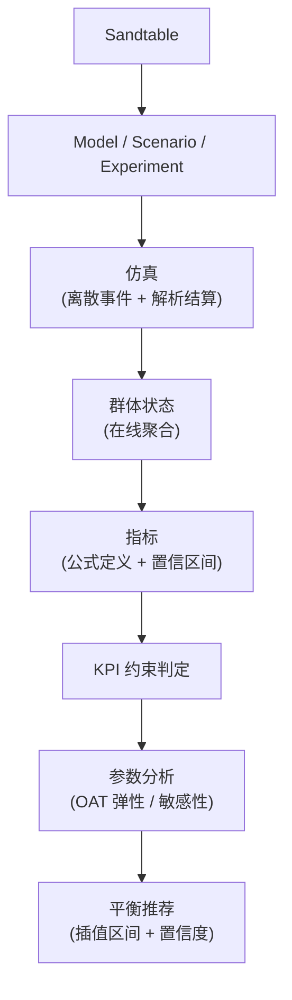

# 设计原则与愿景

## 设计原则

1. **Simulation First**:不先做漂亮 UI;
2. **Deterministic First**:实验必须可复现,同 seed 同版本逐位一致;
3. **Configuration Driven**:游戏数据与引擎解耦(内核抽取后全面配置驱动);
4. **Engine Agnostic**:不绑定 Unity / Unreal / Godot;
5. **Experiment First-Class**:Experiment 是核心模型,不是 CLI 外面的脚本;
6. **Population First**:不模拟"一个平均玩家",模拟群体与分布;
7. **Long-Term First**:不只模拟一场战斗,至少 Day 1 → Day 30;
8. **Measure Before Optimize**:先把仿真、指标、实验、敏感性做对,再做复杂优化;
9. **相对比较优先**:输出的价值在 A/B 差值与置信区间,不在绝对数值的预言(见[定位](./01-positioning));
10. **Local First**:配置、实验、仿真、结果、分析全部本地完成,不需要账号、服务器、数据库、网络;
11. **单核多形态**:CLI / Web / Desktop 共用同一 Rust 内核,不为任何平台重写仿真(见[产品边界](./02-scope))。

## 设计承诺

以下决策经评审确认是本计划最扎实的部分,后续修改需要显式理由:

| 承诺 | 落点 |
| --- | --- |
| Model 与 Scenario 分离 | [核心概念](./03-concepts) |
| Experiment 一等公民 | [核心概念](./03-concepts) · [实验管线](./11-experiment-pipeline) |
| Deterministic First | [确定性随机数](./06-deterministic-rng) · [测试策略](./19-testing) |
| Measure Before Optimize | [路线图](./18-roadmap) |
| MVP 以闭环而非功能数量验收 | [MVP](./16-mvp) |
| 明确列出"不做什么" | [产品边界](./02-scope) |
| 单核多形态与 core 纯净性(平台门禁) | [仿真内核](./04-kernel) · [技术栈](./08-tech-stack) |

## 最终产品形态



目标用户体验:

```text
1. 修改游戏配置
2. 定义实验
3. 运行 10,000 / 100,000 个玩家
4. 推进 7 / 30 / 90 天
5. 查看 KPI(附置信区间)
6. 比较参数
7. 找到敏感参数
8. 获得推荐参数区间(附置信度)
```

而不是:写代码 → 跑脚本 → 自己处理 CSV → 自己用 Excel 分析。

## 一句话定义

> **Sandtable is a configuration-driven simulation and experimentation framework for game systems.**

中文:**Sandtable 是一个面向游戏系统的配置驱动仿真与实验框架,用于长期模拟玩家、战斗、经济和成长系统,并通过实验与指标分析辅助游戏平衡。**

## 愿景

Sandtable 最终应成为**游戏开发者的数字沙盘**。它不是告诉策划"这个技能 DPS 是 12,532",而是帮助回答"把这个参数改掉以后,整个游戏运行 30 天会发生什么"。

```text
Combat Simulation
  → Game System Simulation
    → Game System Experimentation
      → Simulation + Experiment + Measurement + Optimization
```

每一步扩张都以[路线图](./18-roadmap)的验证节点为门,不以愿景为门。
